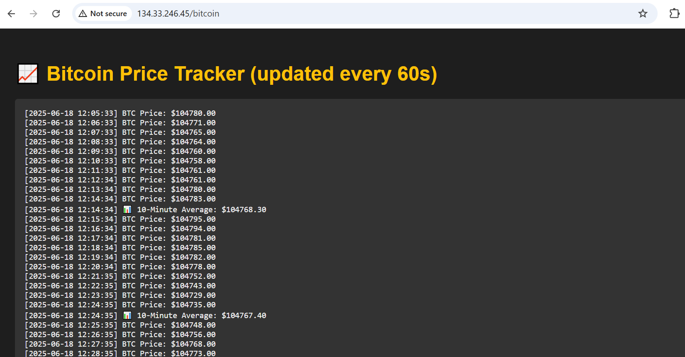
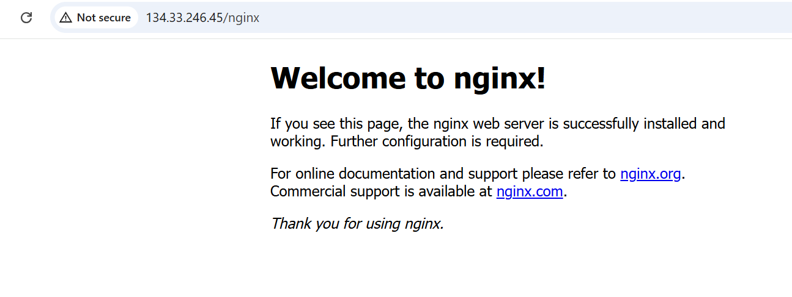

# K8S on Azure: Terraform & Network Policies Project

This project automates the deployment of a production-ready AKS cluster on Azure with NGINX and Bitcoin Monitor services. It features Ingress routing and strict bidirectional Network Policy isolation between services, while maintaining external access. Includes Liveness/Readiness Probes for robust pod management.

## Setup & Deployment

### Build & Push Docker Image

docker build -t YOUR_REGISTRY_NAME/monitor-bitcoin:v4 .
docker push YOUR_REGISTRY_NAME/monitor-bitcoin:v4 (DockerHub)

### Deploy Azure Infrastructure (Terraform) via Azure Colud Shell

terraform init
terraform plan
terraform apply

### Deploy K8S Applications (YAMLs)

kubectl apply -f nginx-deployment.yaml
kubectl apply -f nginx-service.yaml
kubectl apply -f bitcoin-deployment.yaml
kubectl apply -f bitcoin-service.yaml
kubectl apply -f ingress-rules.yaml
kubectl apply -f network-policy.yaml

## Verification

### Verify Pods Running

kubectl get pods

### Get Ingress IP

kubectl get svc -n ingress-nginx ingress-nginx-controller -o jsonpath='{.status.loadBalancer.ingress[0].ip}'

**External Access: Browse `http://<EXTERNAL_IP>` & `http://<EXTERNAL_IP>/bitcoin`**

### Bitcoin Network Policy Blocking (Verify both fail)

**NGINX to Bitcoin:**

kubectl exec -it <NGINX_POD_NAME> -- curl -v http://bitcoin-service:80

**Bitcoin to NGINX:**

kubectl run temp-bitcoin-test-pod --image=alpine/curl --rm -it --labels="app=bitcoin" -- curl -v http://nginx-service:80
